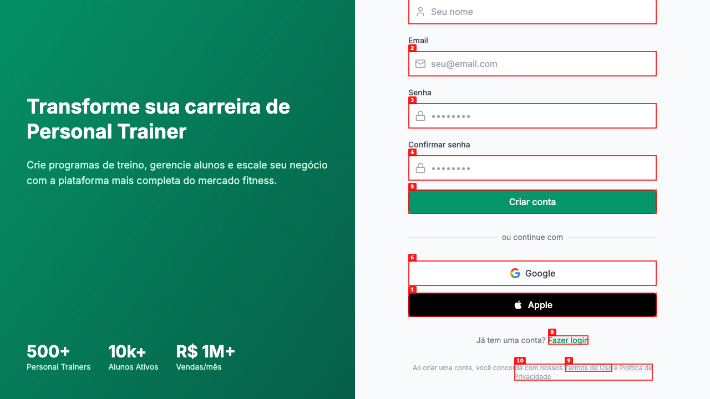
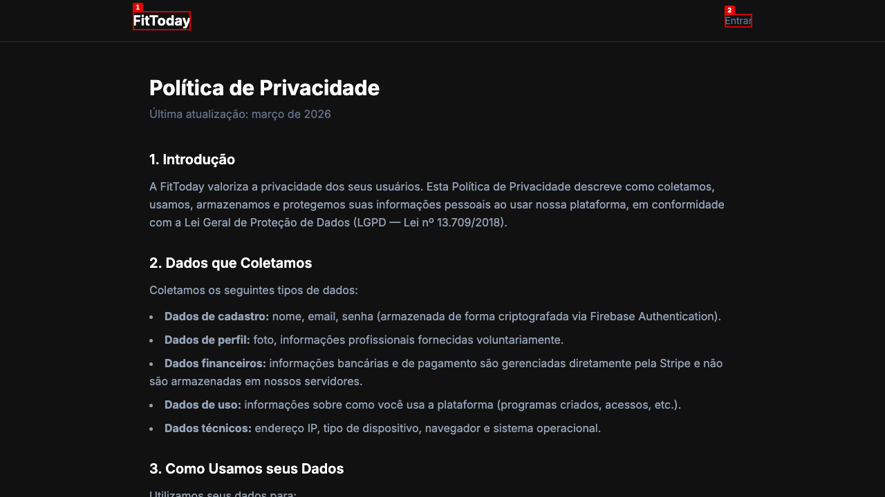

# Dogfood Report: FitToday CMS

| Field | Value |
|-------|-------|
| **Date** | 2026-02-25 |
| **App URL** | https://fittoday.me/cms |
| **Session** | fittoday-cms |
| **Scope** | Full app (login, signup, CMS dashboard) |

## Summary

| Severity | Count |
|----------|-------|
| Critical | 0 |
| High | 1 |
| Medium | 0 |
| Low | 0 |
| **Total** | **1** |

## Issues

### ISSUE-001: Terms of Use and Privacy Policy links return 404

| Field | Value |
|-------|-------|
| **Severity** | high |
| **Category** | functional |
| **URL** | https://fittoday.me/register |
| **Repro Video** | N/A |

**Description**

On the signup page, both the "Termos de Uso" (Terms of Use) and "Política de Privacidade" (Privacy Policy) links at the bottom of the form navigate to pages that return a 404 error ("This page could not be found."). These are legally required pages for a SaaS platform that collects user data. Users cannot review terms before creating an account.

**Repro Steps**

1. Navigate to https://fittoday.me/register and scroll to the bottom of the signup form. The footer text reads "Ao criar uma conta, você concorda com nossos Termos de Uso e Política de Privacidade" with both as clickable links.
   

2. Click "Termos de Uso" link. A 404 page is displayed.
   

3. Navigate back to /register, scroll down, and click "Política de Privacidade". Same 404 page.
   

---
