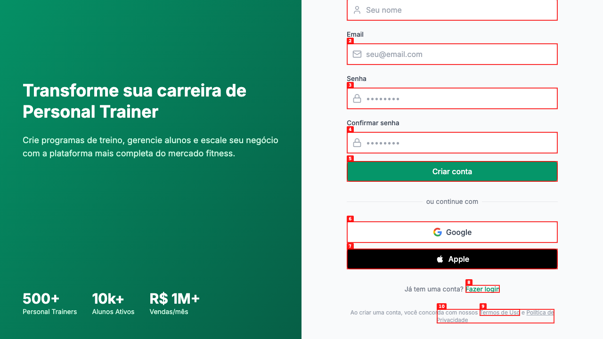
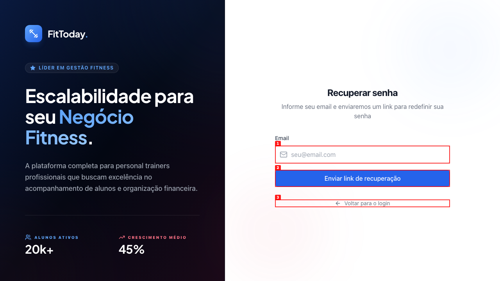
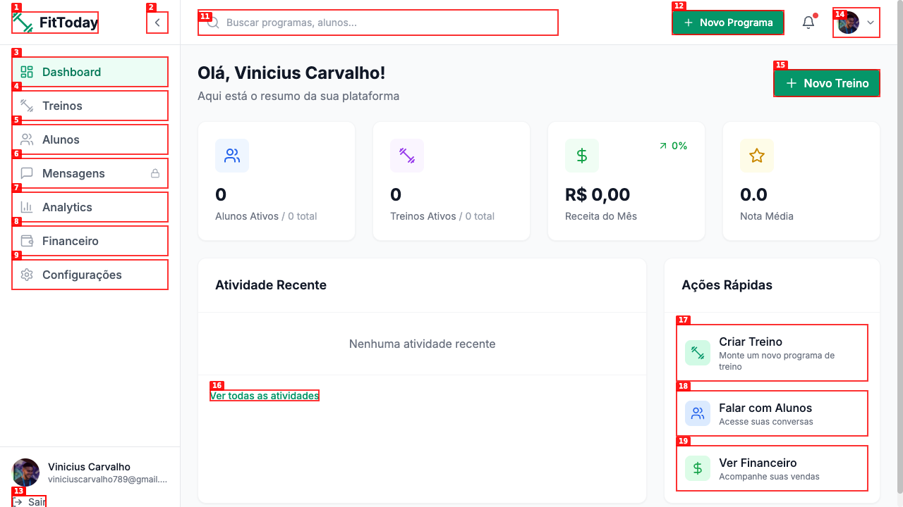
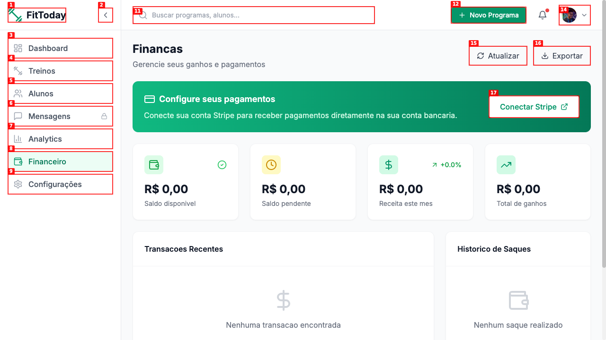
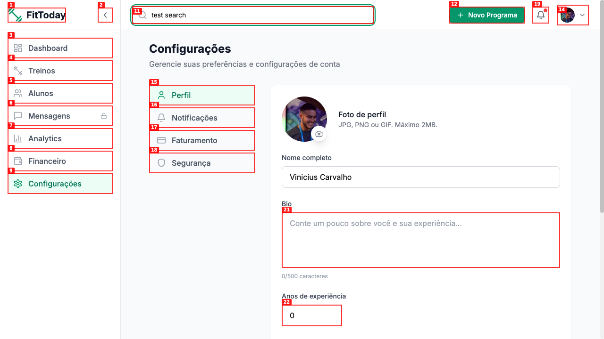

# Dogfood Report: FitToday CMS

| Field | Value |
|-------|-------|
| **Date** | 2026-02-25 |
| **App URL** | https://fittoday.me/cms |
| **Session** | fittoday-cms |
| **Scope** | Full app (login, signup, CMS dashboard) |

## Summary

| Severity | Count |
|----------|-------|
| Critical | 2 |
| High | 1 |
| Medium | 2 |
| Low | 1 |
| **Total** | **6** |

## Issues

### ISSUE-001: Terms of Use and Privacy Policy links return 404

| Field | Value |
|-------|-------|
| **Severity** | high |
| **Category** | functional |
| **URL** | https://fittoday.me/register |
| **Repro Video** | N/A |

**Description**

On the signup page, both the "Termos de Uso" (Terms of Use) and "Política de Privacidade" (Privacy Policy) links at the bottom of the form navigate to pages that return a 404 error ("This page could not be found."). These are legally required pages for a SaaS platform that collects user data. Users cannot review terms before creating an account.

**Repro Steps**

1. Navigate to https://fittoday.me/register and scroll to the bottom of the signup form. The footer text reads "Ao criar uma conta, você concorda com nossos Termos de Uso e Política de Privacidade" with both as clickable links.
   

2. Click "Termos de Uso" link. A 404 page is displayed.
   

3. Navigate back to /register, scroll down, and click "Política de Privacidade". Same 404 page.
   

---

### ISSUE-002: Forgot Password link returns 404

| Field | Value |
|-------|-------|
| **Severity** | critical |
| **Category** | functional |
| **URL** | https://fittoday.me/login |
| **Repro Video** | N/A |

**Description**

The "Esqueceu a senha?" (Forgot your password?) link on the login page navigates to a 404 page. Users who forget their password have no way to reset it through the UI, effectively locking them out of their accounts. This is a critical account recovery failure.

**Repro Steps**

1. Navigate to https://fittoday.me/login. The "Esqueceu a senha?" link is visible next to the password field.
   

2. Click "Esqueceu a senha?" link. A 404 page is displayed instead of a password reset form.
   

---

### ISSUE-003: 404 error page shows English text in an otherwise Portuguese app

| Field | Value |
|-------|-------|
| **Severity** | low |
| **Category** | content |
| **URL** | Any broken link (e.g., /terms, /privacy, /forgot-password) |
| **Repro Video** | N/A |

**Description**

The entire application is in Brazilian Portuguese, but the 404 error page displays "This page could not be found." in English. This is the default Next.js 404 page and should be replaced with a Portuguese version that matches the app's language and branding. There is also no navigation back to the app from this page.

**Repro Steps**

1. Trigger any 404 by visiting a broken link (e.g., click "Esqueceu a senha?" on login page). The 404 page shows English text with no branding or navigation.
   

---

### ISSUE-004: Dashboard throws FirebaseError "Missing or insufficient permissions"

| Field | Value |
|-------|-------|
| **Severity** | critical |
| **Category** | console |
| **URL** | https://fittoday.me/cms |
| **Repro Video** | N/A |

**Description**

After logging in, the browser console shows `Error fetching dashboard data: FirebaseError: Missing or insufficient permissions.` along with multiple 404 resource errors. The dashboard displays all zeros (0 Alunos Ativos, 0 Treinos Ativos, R$ 0,00 Receita do Mês, 0.0 Nota Média). This may indicate Firestore security rules are rejecting the authenticated user's read requests, causing the dashboard to render with empty/default data instead of actual trainer metrics. Additional console errors include Cross-Origin-Opener-Policy warnings blocking `window.closed` and `window.frames` calls (likely from the Google OAuth popup flow).

**Repro Steps**

1. Log in to https://fittoday.me/cms with a valid trainer account. The dashboard loads showing all metrics as zero.
   

2. Open browser console (F12 > Console). Multiple errors are visible, including the Firebase permissions error.

---

### ISSUE-005: Missing Portuguese accents throughout the Financeiro page

| Field | Value |
|-------|-------|
| **Severity** | medium |
| **Category** | content |
| **URL** | https://fittoday.me/cms/financeiro |
| **Repro Video** | N/A |

**Description**

The Financeiro (Financial) page has multiple Portuguese words missing their diacritical marks (accents, cedillas, tildes). This makes the text look unprofessional and grammatically incorrect. Affected words:

- "Financas" → should be "Finanças"
- "Saldo disponivel" → should be "Saldo disponível"
- "Receita este mes" → should be "Receita este mês"
- "Transacoes Recentes" → should be "Transações Recentes"
- "Nenhuma transacao encontrada" → should be "Nenhuma transação encontrada"
- "Historico de Saques" → should be "Histórico de Saques"

**Repro Steps**

1. Navigate to https://fittoday.me/cms/financeiro. Multiple text elements display Portuguese words without their proper accents.
   

---

### ISSUE-006: Global search bar has no visible functionality

| Field | Value |
|-------|-------|
| **Severity** | medium |
| **Category** | ux |
| **URL** | https://fittoday.me/cms (all pages) |
| **Repro Video** | N/A |

**Description**

The global search bar at the top of every page ("Buscar programas, alunos...") accepts text input but provides no feedback — no search results dropdown, no "no results found" message, no loading indicator. Typing and pressing Enter does nothing visible. The search appears to be a non-functional placeholder UI element.

**Repro Steps**

1. On any CMS page, click the search bar at the top and type "test search". Nothing happens — no dropdown, no results, no feedback.
   

---
