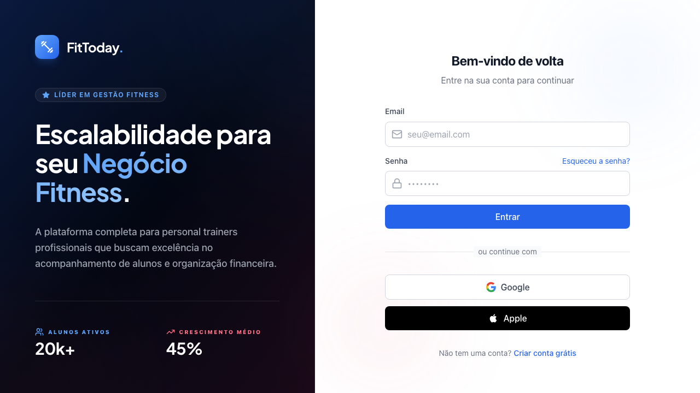
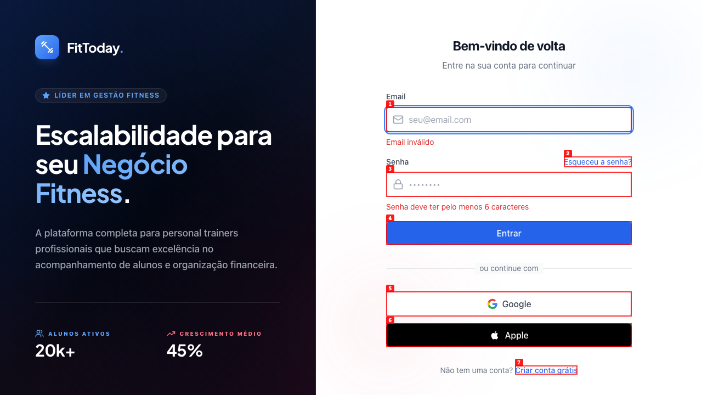
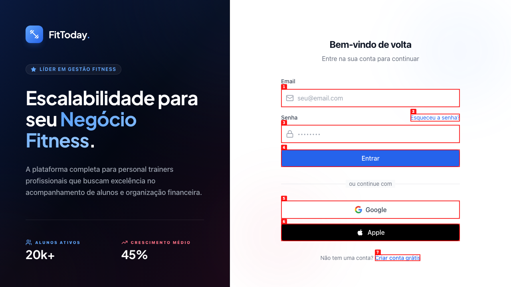
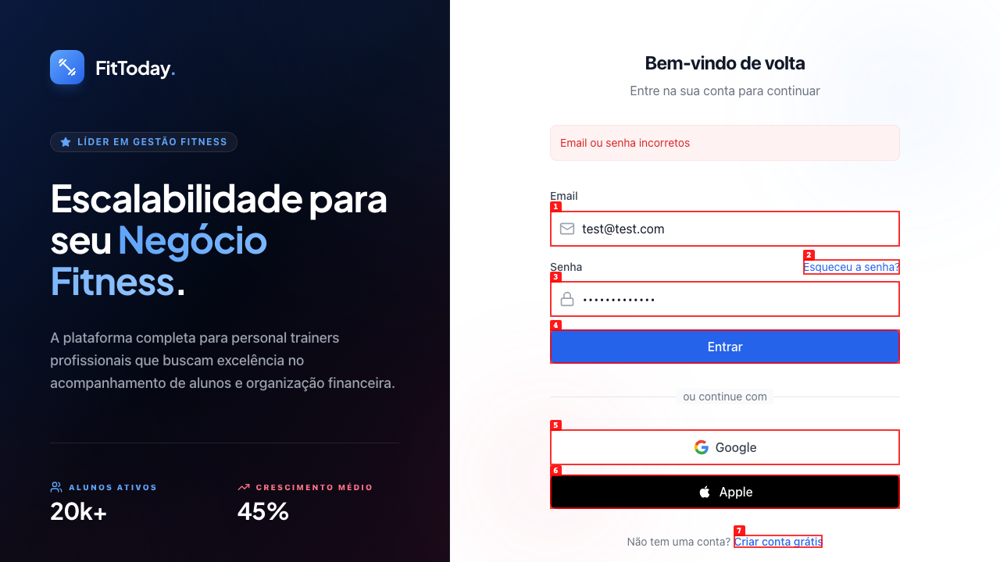
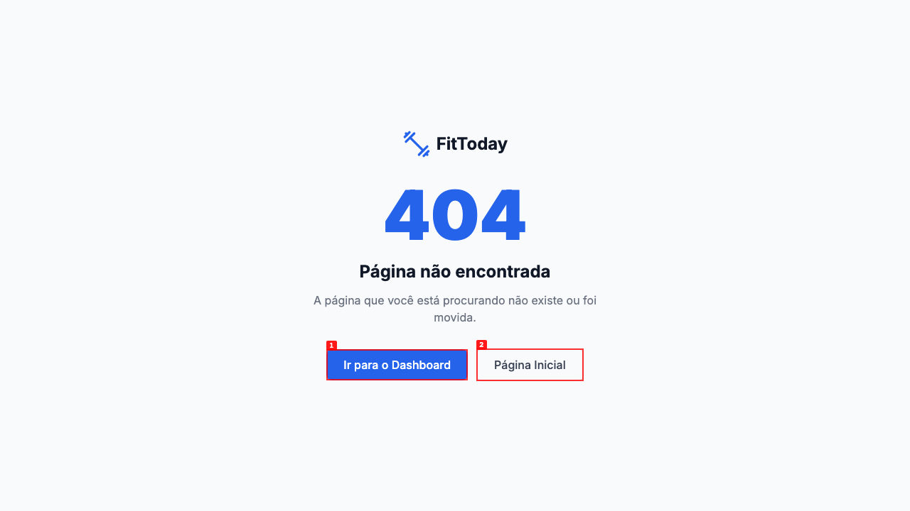

# Dogfood Report: FitToday CMS

| Field       | Value                 |
| ----------- | --------------------- |
| **Date**    | 2026-03-21            |
| **App URL** | http://localhost:3000 |
| **Session** | fittoday-cms          |
| **Scope**   | Full app              |

## Summary

| Severity  | Count |
| --------- | ----- |
| Critical  | 0     |
| High      | 1     |
| Medium    | 2     |
| Low       | 2     |
| **Total** | **5** |

## Issues

---

### ISSUE-001: Register form silently clears all fields after password mismatch — no error shown

| Field           | Value                          |
| --------------- | ------------------------------ |
| **Severity**    | high                           |
| **Category**    | functional / ux                |
| **URL**         | http://localhost:3000/register |
| **Repro Video** | videos/issue-001-repro.webm    |

**Description**

When a user fills the registration form with mismatched passwords and submits, the form sends a request to Firebase, receives a 400 error, and then silently clears all fields — including name, email, and both password fields — without displaying any error message. The user loses all entered data and has no indication of what went wrong. Expected: client-side validation should catch the mismatch before submission and show "As senhas não coincidem".

**Repro Steps**

1. Navigate to http://localhost:3000/register
   

2. Fill in name, email, password ("password123"), and confirm password ("differentpass") — mismatched values
   

3. Click "Criar conta"

4. **Observe:** All form fields are cleared, no error message appears. Console shows `Failed to load resource: 400` from Firebase auth.
   

---

### ISSUE-002: Next.js Image components missing `sizes` prop — performance warning on every page

| Field           | Value                                 |
| --------------- | ------------------------------------- |
| **Severity**    | medium                                |
| **Category**    | performance / console                 |
| **URL**         | http://localhost:3000 (and all pages) |
| **Repro Video** | N/A                                   |

**Description**

Two Unsplash images loaded in the landing page (and persisting across routes) have `fill` layout but are missing the required `sizes` prop. Next.js prints a console warning on every page load, which means the browser cannot optimize image download size for different viewports. Affects Core Web Vitals.

Warning text:

- `Image with src "https://images.unsplash.com/photo-1460925895917-afdab827c52f..." has "fill" but is missing "sizes" prop.`
- `Image with src "https://images.unsplash.com/photo-1510017803434-a899398421b3..." has "fill" but is missing "sizes" prop.`

---

### ISSUE-003: Page `<title>` is "FitToday CMS - Personal Trainer Dashboard" on login and register pages

| Field           | Value                                                       |
| --------------- | ----------------------------------------------------------- |
| **Severity**    | low                                                         |
| **Category**    | content                                                     |
| **URL**         | http://localhost:3000/login, http://localhost:3000/register |
| **Repro Video** | N/A                                                         |

**Description**

Both the `/login` and `/register` pages use the same page title "FitToday CMS - Personal Trainer Dashboard". This is misleading — unauthenticated pages should have distinct, appropriate titles (e.g., "Entrar — FitToday" and "Criar Conta — FitToday"). Affects browser tab display and SEO.

---

### ISSUE-004: Wrong credentials error message appears inline above email field without clear visual styling

| Field           | Value                       |
| --------------- | --------------------------- |
| **Severity**    | low                         |
| **Category**    | ux                          |
| **URL**         | http://localhost:3000/login |
| **Repro Video** | N/A                         |

**Description**

After submitting incorrect credentials, the error "Email ou senha incorretos" appears as plain text inline above the email label, without a distinct error box, red border, or icon. The positioning and lack of visual hierarchy makes it easy to miss. Expected: a clearly styled error state (red alert box or toast notification).

---

### ISSUE-005: `/dashboard` returns 404 instead of redirecting to `/cms`

| Field           | Value                           |
| --------------- | ------------------------------- |
| **Severity**    | medium                          |
| **Category**    | functional / ux                 |
| **URL**         | http://localhost:3000/dashboard |
| **Repro Video** | N/A                             |

**Description**

Navigating to `/dashboard` (the most common URL users would guess for a dashboard) shows a custom 404 page instead of redirecting to `/cms` where the actual CMS lives. New users who type the URL manually or click stale external links will hit a dead end. Expected: `/dashboard` should redirect (301/302) to `/cms` or at minimum the 404 page should not offer "Ir para o Dashboard" as the primary CTA, which is confusing when you're already trying to reach the dashboard.

Additionally, the 404 page's "Página Inicial" button links to `/site` (which works via redirect to `/`) instead of linking directly to `/`.

---
